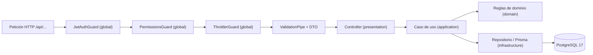
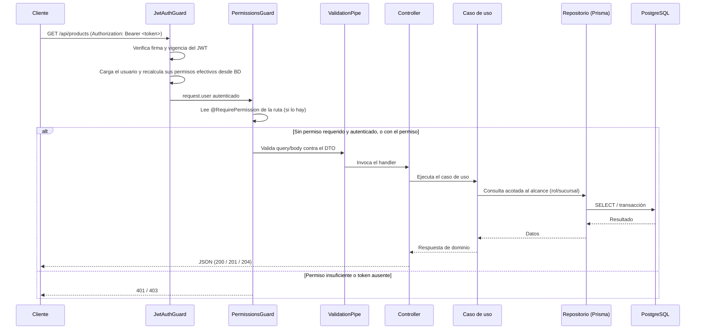

# Visión general de la arquitectura

Descripción de cómo está organizado el backend de Cafeteria System, qué tecnología
usa, cómo se relacionan los módulos y qué ocurre en una petición autenticada.

## 1. Qué es el backend

El backend es una **API REST** construida con NestJS que gestiona la operación de
una cadena de cafeterías con varias sucursales: usuarios y permisos, sucursales,
catálogo de productos con precios por sucursal, inventario con alertas y
recuentos, ventas con anulación, y equipos por sucursal.

Características centrales:

- Todo el tráfico pasa por el prefijo global `/api` (`APP_GLOBAL_PREFIX` en
  `backend/src/config/app.config.ts`).
- Toda ruta requiere autenticación con JWT salvo las marcadas como públicas
  (`@Public()`; por ahora solo `POST /api/auth/login`).
- Las rutas protegidas exigen, además, permisos declarados con
  `@RequirePermission(...)`.
- La configuración se valida al arrancar con Zod (`backend/src/config/env.config.ts`).
- Las pruebas end-to-end reutilizan la misma configuración de la instancia real a
  través de `configureApp` (`backend/src/app.setup.ts`).

## 2. Stack tecnológico

| Capa        | Tecnología                                                          |
| ----------- | ------------------------------------------------------------------- |
| Framework   | NestJS (módulos, DI, guards, pipes y Swagger por decoradores).      |
| Validación  | `class-validator` + `ValidationPipe` (`whitelist`, `forbidNonWhitelisted`, `transform`). |
| Configuración | `@nestjs/config` + esquema Zod.                                   |
| ORM         | Prisma (cliente generado en `backend/src/generated/prisma`), con driver `pg`. |
| Base de datos | PostgreSQL 17 (contenidor en `docker-compose.yml`).               |
| Autenticación | `@nestjs/jwt`, estrategia de guardia que recalcula permisos en cada petición. |
| Limitación de tráfico | `@nestjs/throttler`.                                           |
| Lenguaje    | TypeScript con compilación de Nest (`npm run build`).               |
| Lint        | oxlint (`npm run lint`).                                            |
| CI          | GitHub Actions (ver `backend/.github/workflows/ci.yml`).            |

## 3. Organización en capas

Cada módulo funcional (auth, users, branches, products, inventory, sales,
equipment) se organiza por capas. No es una regla impuesta por Nest, pero es el
patrón seguido por los módulos implementados:

- **presentation**: controllers HTTP, DTOs y guards específicos del módulo.
- **application**: casos de uso orquestando la lógica (operaciones de un paso,
  transacciones).
- **domain**: reglas puras del negocio (alcance por rol/sucursal, invariantes).
- **infrastructure**: adaptadores externos (estrategia JWT, repositorio Prisma).

Elementos comunes en `backend/src/common/`: decoradores `Public`,
`RequirePermission`, `User` y filtros/excepciones globales.

Los tres guards se registran como `APP_GUARD` en `AppModule`, en ese orden.

## 4. Módulos

Todo el código está en `backend/src/modules/`. Estado real de cada paquete:

| Módulo      | Estado      | Superficie HTTP                                          |
| ----------- | ----------- | -------------------------------------------------------- |
| `auth`      | Implementado | `POST /api/auth/login`, `GET /api/auth/me`.              |
| `users`     | Implementado | CRUD de usuarios, estado, contraseñas y permisos individuales. |
| `branches`  | Implementado | CRUD (sin borrado) de sucursales.                        |
| `products`  | Implementado | Catálogo, categorías, variantes y carta/precios por sucursal. |
| `inventory` | Implementado | Insumos, stock, entradas, recuentos, movimientos y alertas. |
| `sales`     | Implementado | Registro, listado, detalle y anulación de ventas.        |
| `equipment` | Implementado | CRUD (sin borrado) de equipos y su historial.            |
| `employees`, `shifts`, `attendance`, `reports` | Esqueleto | Sin controladores registrados; no están importados en `AppModule`. |

Los módulos de personal, turnos, asistencia y reportes son esqueletos: existen
las carpetas e incluso algunos archivos base, pero **no se importan en
`AppModule`**, por lo que no expone rutas. Su presencia en la base de datos es
otra cosa: el esquema, el seed y una migración ya cubren esos dominios
(ver `docs/database/modelo-de-datos.md`).

## 5. Ciclo de una petición autenticada

Con las tiendas de los guards globales y la validación global:

Detalles importantes del flujo:

- **El permiso se recalcula en cada petición**: la estrategia JWT vuelve a la base
  de datos para calcular `permisosEfectivos` (permisos del rol + permisos
  individuales del usuario). Cambiar un rol o revocar un permiso surte efecto
  inmediatamente, sin esperar a que expire el token.
- **Alcance por sucursal**: no depende del guard, sino de las reglas del caso de
  uso. Por ejemplo, un Gerente solo opera con datos de su propia sucursal y una
  sucursal ajena se responde `404`, no `403` (para no filtrar existencia).
- **El `ValidationPipe` rechaza propiedades desconocidas**
  (`forbidNonWhitelisted`): el cuerpo y los query de la petición solo pueden traer
  lo que el DTO declara.

## 6. Arranque y configuración

Flujo de arranque de `backend/src/main.ts`:

1. `NestFactory.create(AppModule)`.
2. `configureApp(app)`: prefijo `/api` + `ValidationPipe` (el mismo código usan
   las pruebas e2e).
3. `enableShutdownHooks()` para cerrar el pool de Prisma ante SIGINT/SIGTERM.
4. Swagger en `/api/docs` si `NODE_ENV !== 'production'`.
5. Escucha en `app.port` (defecto 3000, configurable con `PORT`).

Variables de entorno validadas (defectos entre paréntesis): `DATABASE_URL`
(obligatoria), `PORT` (3000), `NODE_ENV` (development), `JWT_SECRET` (obligatorio,
mínimo 32), `JWT_EXPIRES_IN` (8h). Ver `backend/src/config/env.config.ts`.

## 7. Frontend

El directorio `frontend/` aún no tiene implementación (solo el esqueleto del
monorepo). No existe aplicación cliente que consuma la API en estos momentos; la
referencia de contrato es la [API](../api/referencia-api.md) y los documentos de
diseño en `docs/design/`.