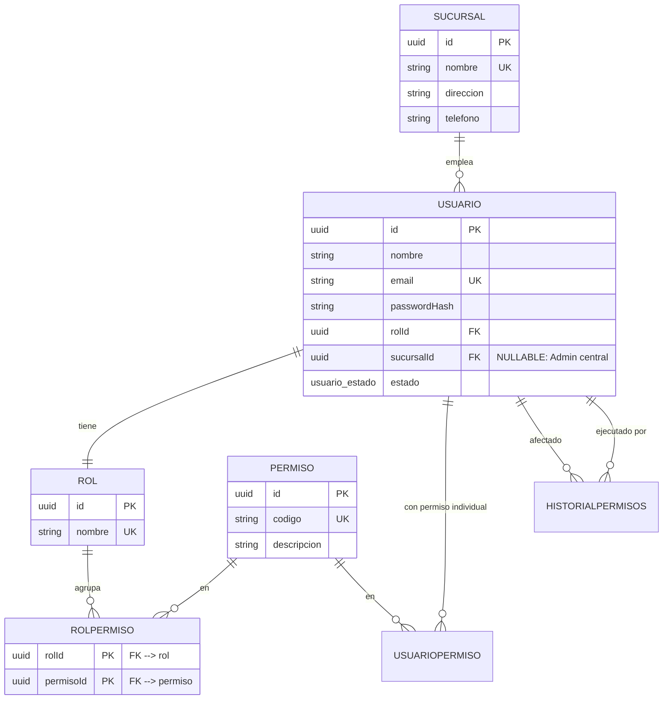
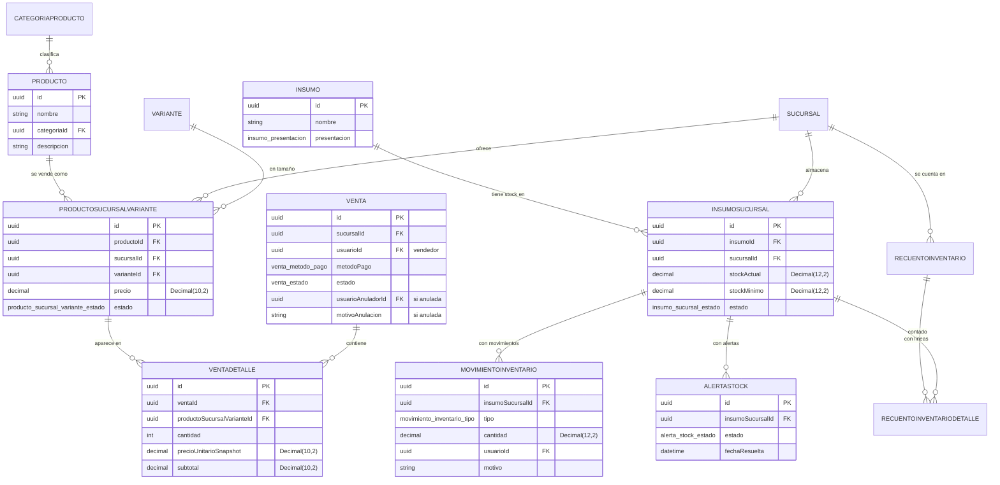
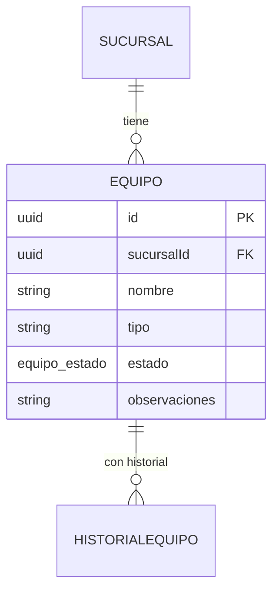

# Modelo de datos

Estructura de la base de datos PostgreSQL 17 del backend. El esquema fuente está
en [modelo.dbml](database/modelo.dbml) y de él se genera
`backend/prisma/schema.prisma`; ambos deben permanecer en sincronía.

## 1. Convenciones

- Modelos en **PascalCase singular** con `@@map` al nombre plural de la tabla en
  snake_case (p. ej. `Sucursal` → `sucursal`, `UsuarioPermiso` → `usuario_permiso`).
- Campos en **camelCase** con `@map` al nombre de columna en snake_case
  (`createdAt` → `created_at`, `stockActual` → `stock_actual`).
- Identificadores **UUID v7** (`@default(uuid(7)) @db.Uuid`).
- Sello de tiempo `created_at`/`updated_at` en la mayoría de las tablas.
- **Todas las relaciones usan `onDelete: Restrict`**: nada se borra de forma
  cascada desde la base; la eliminación lógica del catálogo está controlada por
  la API.

## 2. Dominios de datos

| Dominio        | Modelos                                                        |
| -------------- | -------------------------------------------------------------- |
| Organización   | `Sucursal`                                                     |
| Seguridad      | `Rol`, `Permiso`, `RolPermiso`, `Usuario`, `UsuarioPermiso`, `HistorialPermisos` |
| Personal       | `Empleado`, `Turno`, `AsignacionTurno`, `RegistroAsistencia`, `JustificacionFalta` |
| Catálogo       | `CategoriaProducto`, `Producto`, `Variante`, `ProductoSucursalVariante` |
| Inventario     | `Insumo`, `InsumoSucursal`, `MovimientoInventario`, `RecuentoInventario`, `RecuentoInventarioDetalle`, `AlertaStock` |
| Ventas         | `Venta`, `VentaDetalle`                                        |
| Equipamiento   | `Equipo`, `HistorialEquipo`                                    |

Los modelos del dominio **Personal** existen en el esquema. El módulo `employees`
ya opera `Empleado` (alta, edición, cese y PIN) y `JustificacionFalta`
(actualmente solo su tabla inmutable); los módulos `shifts`/`attendance` aún no
tienen lógica operativa (las tablas de turnos y asistencia están preparadas por
la migración, no operadas por la API de hoy).

## 3. Relevancia por dominio

### Seguridad y organización

Puntos clave de seguridad:

- `USUARIO.sucursalId` es **nullable**: el Admin es un usuario central, sin
  sucursal.
- `ROLPERMISO` tiene clave compuesta `(rolId, permisoId)`.
- `USUARIOPERMISO` tiene `tipo` (`concedido`/`revocado`) y unicidad
  `(usuarioId, permisoId)`. Los **permisos efectivos** = permisos del rol + la
  suma de concesiones/revocaciones individuales.
- `HISTORIALPERMISOS` registra quién asignó/revocó qué, a quién y cuándo, con dos
  relaciones al mismo usuario (afectado y ejecutor).

### Catálogo, inventario y ventas

### Equipamiento

El historial se escribe solo cuando cambia el **estado** o las **observaciones**
del equipo; nunca se borran equipos.

## 4. Enums

Los enums de PostgreSQL (tipos `usuario_estado`, `insumo_presentacion`, etc.) se
leen de `backend/prisma/schema.prisma`:

| Enum                         | Valores                                                    |
| ---------------------------- | ---------------------------------------------------------- |
| `UsuarioEstado`              | `activo`, `bloqueado`                                       |
| `UsuarioPermisoTipo`         | `concedido`, `revocado`                                     |
| `HistorialPermisosAccion`    | `asignado`, `revocado`                                      |
| `EmpleadoEstado`             | `activo`, `inactivo`                                        |
| `TurnoTipo`                  | `fijo`, `variable`                                          |
| `RegistroAsistenciaTipo`     | `entrada`, `salida`                                         |
| `ProductoSucursalVarianteEstado` | `activo`, `inactivo`                                   |
| `InsumoPresentacion`         | `paquete`, `bolsa`, `caja`, `unidad`, `paquete_varias_unidades` |
| `InsumoSucursalEstado`       | `activo`, `descontinuado`                                   |
| `MovimientoInventarioTipo`   | `entrada`, `ajuste`                                         |
| `AlertaStockEstado`          | `abierta`, `resuelta`                                       |
| `VentaMetodoPago`            | `efectivo`, `tarjeta`                                       |
| `VentaEstado`                | `completada`, `anulada`                                     |
| `EquipoEstado`               | `funcionando`, `danado`, `en_mantenimiento`, `retirado`     |

> Nota: `EquipoEstado` usa `danado` (sin tilde) en código y base, tal como quedó
> documentado en [Decisiones de diseño](architecture/decisiones-de-diseno.md).

## 5. Precisiones

| Campo                        | Tipo        | Significado                          |
| ---------------------------- | ----------- | ------------------------------------ |
| Precios y subtotales         | `Decimal(10, 2)` | Importes de hasta 8 dígitos, 2 decimales. |
| `stockActual`, `stockMinimo`, cantidades de movimiento/recuento | `Decimal(12, 2)` | Stock con 2 decimales (por presentaciones no enteras). |
| `VentaDetalle.cantidad`      | `Int`       | Cantidad entera positiva por línea.  |
| Fechas de empleado y asignaciones | `Date`  | Día calendario.                      |
| `Empleado.pinHash` | `Varchar` | Hash bcrypt (12 rondas) del PIN de marcación; `null` hasta que se genera. El PIN en claro (6 dígitos) no se guarda. |
| `Turno.horaInicio`/`horaFin`      | `Time`      | Horario del turno (**nullable**: un turno puede no tener horario). |
| `RegistroAsistencia.fechaHora` | `DateTime` | Momento exacto de la marcación.     |

## 6. Reglas de integridad de la base

La migración personalizada **`20261004235135_db_integrity_rules`** añade reglas
que Prisma no puede expresar en el esquema. Nada de esto está en la capa de
aplicación:

1. **`registro_asistencia` es inmutable** (solo INSERT). Un trigger
   (`fn_registro_asistencia_es_inmutable`) rechaza `UPDATE` y `DELETE`. Las
   correcciones se modelan insertando un registro nuevo con `es_correccion = true`.
   El `TRUNCATE` no está bloqueado a propósito.
2. **Una sola alerta abierta por insumo y sucursal**: índice único parcial
   `idx_alerta_stock_abierta_por_insumo_sucursal` sobre `alerta_stock
   (insumo_sucursal_id) WHERE estado = 'abierta'`. Al resolverse, deja de contar y
   puede abrirse una nueva.
3. **Anulación de venta coherente** (`chk_venta_anulacion_coherente`): una venta
   `anulada` exige fecha, anulador y motivo; una `completada` no admite ninguno.
4. **Alerta con fecha resuelta coherente** (`chk_alerta_stock_fecha_resuelta_coherente`).
5. **Corrección de asistencia coherente** (`chk_registro_asistencia_correccion_coherente`).
6. **No negativos**: cantidad y subtotales de `venta_detalle`, precio de
   `producto_sucursal_variante`, y `stock_minimo` y `stock_actual` de
   `insumo_sucursal`.
7. **Cese posterior a contratación** (`chk_empleado_cese_posterior_a_contratacion`).

La migración **`20261009120000_chk_insumo_sucursal_stock_actual_no_negativo`** añade
el `CHECK` `chk_insumo_sucursal_stock_actual_no_negativo` (`stock_actual >= 0`), que
completa el punto 6: el stock **nunca puede quedar negativo**, aunque se escriba
por fuera de la aplicación.

La migración **`20261010120000_personal_etapa1_pin_hash_turnos_justificacion_falta`**
añade:

8. **`justificacion_falta` es inmutable** (solo insert). Un trigger
   (`fn_justificacion_falta_es_inmutable`, disparado `BEFORE UPDATE OR DELETE`) rechaza
   `UPDATE` y `DELETE` con una excepción de tipo `P0001`, igual que
   `registro_asistencia`: lo ya justificado no se edita ni se borra.
9. **`empleado.pin_hash`** (`varchar`, nullable): solo guarda el hash bcrypt del PIN
   de marcación.
10. **`turno.hora_inicio` y `turno.hora_fin` nullable**: un turno puede no tener
    horario.

## 7. Comportamientos notables del dominio

- **Ventas**: el precio se congela en `VentaDetalle.precioUnitarioSnapshot` al
  registrar; los totales los calcula el servidor, y registrar una venta **no
  descuenta inventario** (regla confirmada en
  [Decisiones de diseño](architecture/decisiones-de-diseno.md)).
- **Inventario**: el stock solo varía con entradas (`> 0`) y recuentos; un recuento
  guarda `stockSistema`, `stockFisico` y `diferencia` por línea, y no existe forma
  de "editar" el stock a mano.
- **Movimientos**: `MovimientoInventario.cantidad` guarda la **variación** (+/-),
  no el saldo.
- **Alertas**: se abren y cierran solas dentro de la transacción que cambió
  stock, mínimo o estado; no hay endpoint para abrirlas/cerrarlas manualmente.
- **Equipos**: no tienen borrado, cambian de estado sobre un conjunto cerrado y
  mantienen historial de cambios de estado y observaciones.

## 8. Relación con el DBML

`docs/database/modelo.dbml` es la fuente de diseño; `backend/prisma/schema.prisma`
se generó desde él. Las migraciones aplicadas (ver el historial en
`backend/prisma/migrations/`) son la fuente de verdad de lo que existe en la base
de datos real.